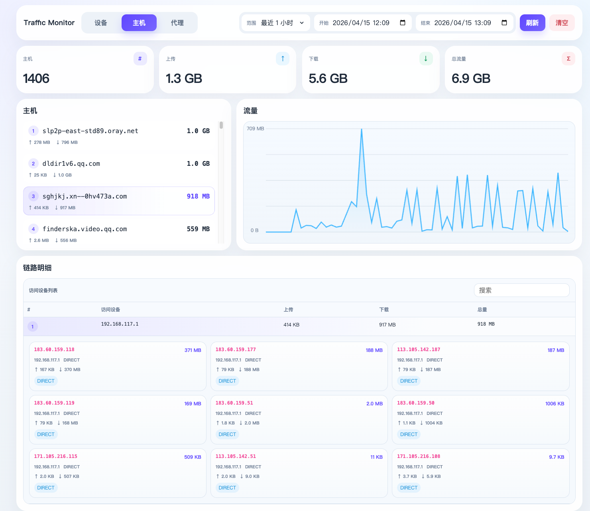

# Traffic Monitor

`Traffic Monitor` 是一个独立运行的 Go 服务，用来从 Mihomo 采集局域网流量使用情况。

它会定时轮询 Mihomo 的 `/connections` 接口，把每次连接的流量增量写入 SQLite，并通过同一个二进制内置提供 Web 管理界面。

## 功能特性

- 定时稳定采集 Mihomo 连接流量
- 使用 SQLite 持久化保存历史数据
- 自带单页 Web 界面，无需额外前端部署
- 支持按来源 IP、域名、出站分组聚合统计
- 支持继续下钻查看访问对象与节点链路明细
- 提供趋势查询接口和历史清理接口
- 适合直接用 Docker 部署

## 页面预览



## 内置 Web 界面

项目中的 `web/` 目录会通过 Go 的 `embed` 能力直接打进可执行文件。

这意味着：

- 编译后的二进制已经包含前端页面
- 用本项目构建出的 Docker 镜像也自带页面资源
- 不需要单独执行前端打包步骤

## 配置说明

| 变量名 | 默认值 | 说明 |
| --- | --- | --- |
| `MIHOMO_URL` | `http://127.0.0.1:9090` | Mihomo Controller 地址 |
| `MIHOMO_SECRET` | 空 | Mihomo Bearer Token |
| `TRAFFIC_MONITOR_LISTEN` | `:8080` | HTTP 监听地址 |
| `TRAFFIC_MONITOR_DB` | `./traffic_monitor.db` | SQLite 数据库文件路径 |
| `TRAFFIC_MONITOR_POLL_INTERVAL_MS` | `2000` | 轮询间隔，单位毫秒 |
| `TRAFFIC_MONITOR_RETENTION_DAYS` | `30` | 数据保留天数 |
| `TRAFFIC_MONITOR_ALLOWED_ORIGIN` | `*` | CORS 允许来源 |

同时兼容旧变量：`CLASH_API` 和 `CLASH_SECRET`。

## 本地运行

```bash
go test ./...
go build -o traffic-monitor-enhanced main.go
MIHOMO_URL=http://127.0.0.1:9090 ./traffic-monitor-enhanced
```

启动后访问：

```text
http://localhost:8080/
```

## Docker 部署

程序本身带有默认配置，不提供 `.env` 也能启动。

默认值包括：

- `MIHOMO_URL=http://127.0.0.1:9090`
- `MIHOMO_SECRET=` 空
- `TRAFFIC_MONITOR_LISTEN=:8080`

但在 Docker 容器里，`127.0.0.1` 指向的是容器自己，不是宿主机，所以实际部署时通常至少要显式传入 `MIHOMO_URL`。

最简单的启动方式：

```bash
mkdir -p data

docker run -d \
  --name traffic-monitor \
  --restart unless-stopped \
  -p 8080:8080 \
  -e MIHOMO_URL=http://host.docker.internal:9090 \
  -e MIHOMO_SECRET=your-secret \
  -v "$(pwd)/data:/data" \
  zhf883680/clash-traffic-monitor:latest
```

如果你的 Mihomo 没有设置密钥，可以把这一行删掉，或者直接留空：

```bash
-e MIHOMO_SECRET=
```

如果你更习惯配置文件，也可以继续使用：

```bash
cp .env.example .env
docker compose up --build -d
```

默认数据库文件保存在：

```text
./data/traffic_monitor.db
```

常用命令：

```bash
# 查看日志
docker logs -f traffic-monitor

# 重启容器
docker restart traffic-monitor

# 停止并删除容器
docker rm -f traffic-monitor
```

## 发布流程

仓库内已经包含 GitHub Actions 发布工作流，可用于自动构建发行产物并发布。

当前发布目标包括：

- 二进制文件：`linux/amd64`、`linux/arm64`、`windows/amd64`
- Docker 镜像：`linux/amd64`、`linux/arm64`

默认镜像名：

```text
zhf883680/clash-traffic-monitor
```

## API 示例

```bash
curl http://localhost:8080/health
curl "http://localhost:8080/api/traffic/aggregate?dimension=sourceIP&start=1713000000000&end=1713086400000"
curl "http://localhost:8080/api/traffic/trend?start=1713000000000&end=1713086400000&bucket=60000"
curl -X DELETE http://localhost:8080/api/traffic/logs
```

## 工作原理

- 轮询 Mihomo `/connections`
- 按连接 ID 计算每条连接的上传和下载增量
- 将流量增量持久化写入 SQLite
- 当 Mihomo 计数器回退时重置内存中的基线
- 服务重启后仍能保留历史数据

## 参考项目

当前独立页面的流量监控与交互设计参考了 `MetaCubeX/metacubexd` 项目中的流量与连接页面能力，并在此基础上做了更轻量的独立部署实现。

参考仓库：

```text
https://github.com/MetaCubeX/metacubexd
```
